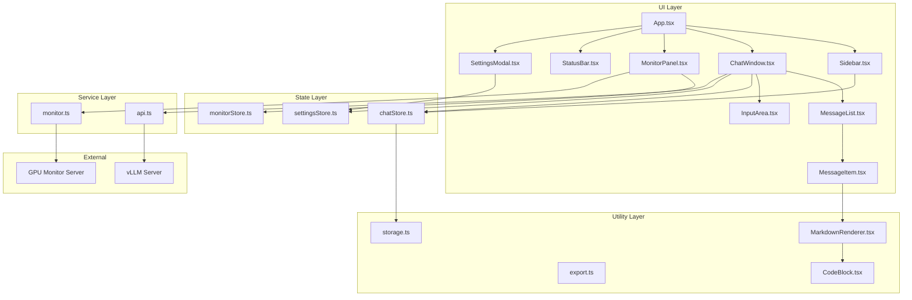

# vLLM Chat Client - Project Codemap

> Generated: 2026-03-09 18:30  
> Project: vLLM Chat Client - A ChatGPT-like web client for local vLLM deployments

---

## 1. Project Overview

| Attribute | Value |
|-----------|-------|
| **Name** | vLLM Chat Client |
| **Type** | React + TypeScript SPA |
| **Build Tool** | Vite 5 |
| **Styling** | Tailwind CSS 3 |
| **State Management** | Zustand |
| **Purpose** | ChatGPT-like interface for local vLLM/OpenAI-compatible API endpoints |

---

## 2. Architecture Diagram



---

## 3. Module Breakdown

### 3.1 Entry Point

| File | Purpose |
|------|---------|
| [main.tsx](/home/jd/self-llm-client/src/main.tsx) | React application entry point |
| [App.tsx](/home/jd/self-llm-client/src/App.tsx) | Root component, theme management, keyboard shortcuts, error handling |

**App.tsx Key Responsibilities:**
- Theme switching (light/dark/system) with system preference detection
- Global keyboard shortcuts (Ctrl+N new chat, Ctrl+, settings)
- Error toast notifications
- Layout composition: Sidebar | ChatWindow | MonitorPanel + StatusBar

---

### 3.2 Components Layer

| Component | File | Key Props | Purpose |
|-----------|------|-----------|---------|
| **Sidebar** | [Sidebar.tsx](/home/jd/self-llm-client/src/components/Sidebar.tsx) | `onOpenSettings` | Chat list navigation, create/rename/delete chats |
| **ChatWindow** | [ChatWindow.tsx](/home/jd/self-llm-client/src/components/ChatWindow.tsx) | `onError` | Main chat orchestration, message sending, streaming |
| **MessageList** | [MessageList.tsx](/home/jd/self-llm-client/src/components/MessageList.tsx) | `messages`, `onRegenerate`, `isGenerating` | Scrollable message container |
| **MessageItem** | [MessageItem.tsx](/home/jd/self-llm-client/src/components/MessageItem.tsx) | `message`, `onRegenerate`, `isGenerating` | Single message rendering with actions |
| **InputArea** | [InputArea.tsx](/home/jd/self-llm-client/src/components/InputArea.tsx) | `onSend`, `onStop`, `isGenerating`, `disabled` | User input with send/stop buttons |
| **SettingsModal** | [SettingsModal.tsx](/home/jd/self-llm-client/src/components/SettingsModal.tsx) | `isOpen`, `onClose` | Settings panel (endpoint, model, temperature, etc.) |
| **MonitorPanel** | [MonitorPanel.tsx](/home/jd/self-llm-client/src/components/MonitorPanel.tsx) | - | GPU metrics visualization panel |
| **StatusBar** | [StatusBar.tsx](/home/jd/self-llm-client/src/components/StatusBar.tsx) | - | Bottom status bar with connection info |
| **MarkdownRenderer** | [MarkdownRenderer.tsx](/home/jd/self-llm-client/src/components/MarkdownRenderer.tsx) | `content` | Markdown rendering with GFM support |
| **CodeBlock** | [CodeBlock.tsx](/home/jd/self-llm-client/src/components/CodeBlock.tsx) | `code`, `language` | Syntax-highlighted code with copy button |

---

### 3.3 State Management (Zustand Stores)

#### ChatStore ([chatStore.ts](/home/jd/self-llm-client/src/stores/chatStore.ts))

```typescript
interface ChatState {
  chats: Chat[];
  activeChatId: string | null;
  isGenerating: boolean;
  abortController: AbortController | null;
  
  // Chat operations
  createChat, deleteChat, renameChat, setActiveChat, updateChatSystemPrompt
  
  // Message operations
  addMessage, updateMessage, appendToMessage, appendReasoningToMessage,
  setMessageHttpRequest, deleteMessage
  
  // Generation control
  setGenerating, stopGeneration
  
  // Helpers
  getActiveChat
}
```

**Key Behaviors:**
- Auto-title from first user message
- Persist chats to LocalStorage via `storage.ts`
- Streaming append operations don't save to storage (performance)
- Final state saved on completion/error

#### SettingsStore ([settingsStore.ts](/home/jd/self-llm-client/src/stores/settingsStore.ts))

```typescript
interface SettingsState {
  settings: Settings;
  updateSettings, resetSettings
}

interface Settings {
  endpoint: string;      // default: http://localhost:8000
  model: string;
  temperature: number;   // default: 0.7
  maxTokens: number;     // default: 2048
  theme: 'light' | 'dark' | 'system';
}
```

#### MonitorStore ([monitorStore.ts](/home/jd/self-llm-client/src/stores/monitorStore.ts))

```typescript
interface MonitorState {
  metrics: GpuMetrics | null;
  vllmStats: VllmStats;
  settings: MonitorSettings;
  isConnected: boolean;
  
  // Actions
  setMetrics, setVllmStats, updateSettings, setConnected
}
```

---

### 3.4 Service Layer

#### API Service ([api.ts](/home/jd/self-llm-client/src/services/api.ts))

| Function | Purpose |
|----------|---------|
| `fetchModels(endpoint)` | GET /v1/models - List available models |
| `streamChatCompletion(...)` | POST /v1/chat/completions with SSE streaming |
| `checkEndpointHealth(endpoint)` | Health check with 5s timeout |

**Streaming Flow:**
1. Build messages array (system prompt + conversation history)
2. Emit request info via `onRequestInfo` callback
3. Fetch with `stream: true`
4. Read response body via `getReader()`
5. Parse SSE data lines, extract `delta.content` and `delta.reasoning`
6. Call `onToken` / `onReasoning` callbacks for each chunk
7. Signal completion via `onComplete` or `onError`

#### Monitor Service ([monitor.ts](/home/jd/self-llm-client/src/services/monitor.ts))

- Polls GPU monitor server endpoint
- Parses amdgpu_top JSON output
- Calculates tokens/second from generation timing

---

### 3.5 Type Definitions ([types/index.ts](/home/jd/self-llm-client/src/types/index.ts))

```typescript
// Core domain types
Message { id, role, content, reasoning?, httpRequest?, timestamp }
Chat { id, title, messages, systemPrompt, createdAt, updatedAt }
Settings { endpoint, model, temperature, maxTokens, theme }

// API types
Model { id, object, created, owned_by }
ChatCompletionChunk { id, object, created, model, choices[] }
ApiError { message, code? }
HttpRequestInfo { method, url, headers, body, timestamp }

// GPU Monitoring types
GpuMetrics { deviceName, pci, utilization, vram, sensors, timestamp }
VllmStats { tokensPerSecond?, queueDepth?, activeRequests? }
MonitorSettings { enabled, endpoint, pollingInterval }
```

---

### 3.6 Utilities

| File | Purpose |
|------|---------|
| [storage.ts](/home/jd/self-llm-client/src/utils/storage.ts) | LocalStorage persistence for chats |
| [export.ts](/home/jd/self-llm-client/src/utils/export.ts) | Export chats to JSON/Markdown |

---

### 3.7 External Tools

| File | Purpose |
|------|---------|
| [gpu-monitor-server.py](/home/jd/self-llm-client/tools/gpu-monitor-server.py) | Python HTTP proxy for amdgpu_top GPU metrics |

**Endpoints:**
- `GET /gpu-stats` - Returns amdgpu_top JSON
- `GET /health` - Health check

---

## 4. Data Flow

### 4.1 Chat Message Flow

```
User Input → InputArea → ChatWindow.handleSend()
    ↓
chatStore.addMessage(user) → LocalStorage
    ↓
chatStore.addMessage(assistant, empty) → Get assistantMsgId
    ↓
api.streamChatCompletion()
    ↓
SSE Stream → onToken() → chatStore.appendToMessage()
    ↓
onComplete() → chatStore.setGenerating(false) → LocalStorage
```

### 4.2 Theme Flow

```
System Preference / User Selection → settingsStore
    ↓
App.tsx useEffect → document.documentElement.classList.add/remove('dark')
    ↓
Tailwind dark: variants apply
```

---

## 5. Key Dependencies

| Package | Purpose |
|---------|---------|
| react, react-dom | UI framework |
| zustand | State management |
| react-markdown | Markdown rendering |
| remark-gfm | GitHub Flavored Markdown |
| rehype-highlight | Syntax highlighting |
| lucide-react | Icons |
| nanoid | ID generation |
| tailwindcss | Styling |
| vite | Build tool |

---

## 6. External API Contracts

### 6.1 vLLM/OpenAI Compatible API

| Endpoint | Method | Purpose |
|----------|--------|---------|
| `/v1/models` | GET | List available models |
| `/v1/chat/completions` | POST | Streaming chat completion |

**Request Format:**
```json
{
  "model": "model-name",
  "messages": [{"role": "user", "content": "..."}],
  "stream": true,
  "temperature": 0.7,
  "max_tokens": 2048
}
```

**SSE Response Format:**
```
data: {"id":"...","choices":[{"delta":{"content":"token"}}]}

data: [DONE]
```

### 6.2 GPU Monitor Server

| Endpoint | Method | Purpose |
|----------|--------|---------|
| `/gpu-stats` | GET | GPU metrics from amdgpu_top |
| `/health` | GET | Health check |

---

## 7. File Index

```
src/
├── App.tsx                    # Root component
├── main.tsx                   # Entry point
├── index.css                  # Tailwind + custom styles
├── components/
│   ├── ChatWindow.tsx         # Main chat orchestration
│   ├── Sidebar.tsx            # Chat list navigation
│   ├── MessageList.tsx        # Messages container
│   ├── MessageItem.tsx        # Single message with actions
│   ├── InputArea.tsx          # User input + send/stop
│   ├── SettingsModal.tsx      # Settings panel
│   ├── MonitorPanel.tsx       # GPU metrics panel
│   ├── StatusBar.tsx          # Bottom status bar
│   ├── MarkdownRenderer.tsx   # Markdown rendering
│   └── CodeBlock.tsx          # Code blocks with copy
├── stores/
│   ├── chatStore.ts           # Chat & message state
│   ├── settingsStore.ts       # Settings state
│   └── monitorStore.ts        # GPU monitor state
├── services/
│   ├── api.ts                 # vLLM API client
│   └── monitor.ts             # GPU monitor client
├── types/
│   └── index.ts               # TypeScript interfaces
└── utils/
    ├── storage.ts             # LocalStorage helpers
    └── export.ts              # Export utilities

tools/
└── gpu-monitor-server.py      # GPU metrics HTTP proxy
```

---

## 8. Hotspots & Extension Points

| Area | Extension Ideas |
|------|-----------------|
| MessageItem.tsx | Add message editing, reactions, threading |
| api.ts | Add retry logic, request interceptors, caching |
| chatStore.ts | Add conversation search, folders, tags |
| SettingsModal.tsx | Add custom headers, proxy settings |
| MonitorPanel.tsx | Add multi-GPU support, historical charts |

---

*End of Codemap*
